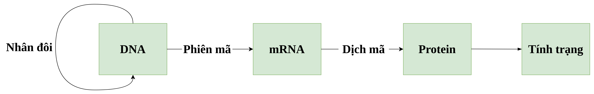
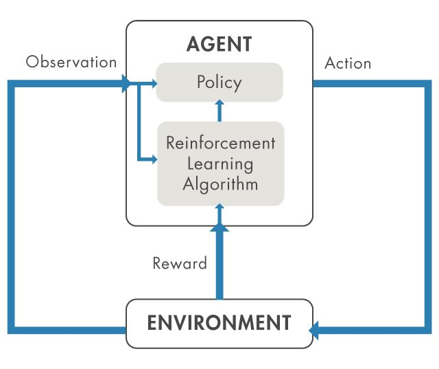
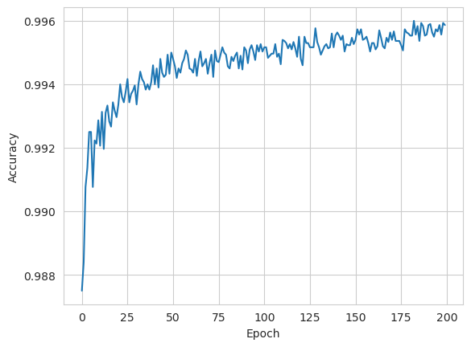
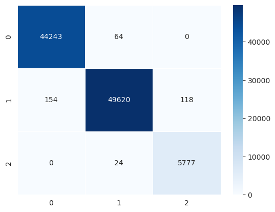
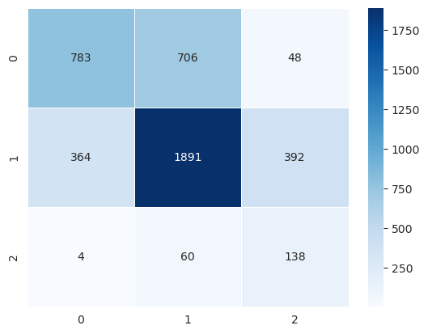
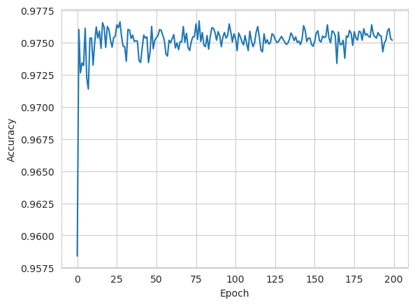
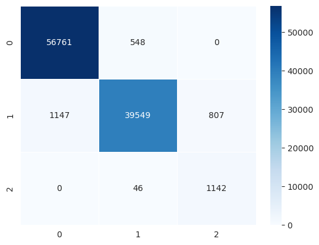
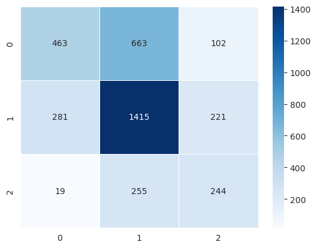

`\pagestyle{empty}\pagenumbering{roman}`{=latex}

# Lời cảm ơn {.unnumbered .unlisted}
Lời đầu tiên, em xin gửi lời cảm ơn chân thành nhất đến những người đã dạy dỗ, hướng dẫn, động viên em, giúp hoàn thành 4 năm đại học cũng như khóa luận này.

Đầu tiên em xin gửi lời cảm ơn đến những thầy cô là cán bộ giảng viên của trường Đại học Khoa học Tự nhiên, Đại học Quốc gia Hà Nội và các thầy cô công tác tại Khoa Toán - Cơ - Tin học, mọi người đã truyền đạt cho em rất nhiều kiến thức và kỹ năng trở thành nguồn động lực của em để tiếp bước trong 4 năm đại học cũng như sau này, và đăc biệt em xin gửi lời cảm ơn sâu sắc nhất đến cô PGS.TS Nguyễn Thị Hồng Minh, người đã trực tiếp dạy dỗ em từ năm thứ hai tới giờ, cho em nhiều trải nhiệm quý báu. Cảm ơn cô đã trực tiếp hướng dẫn và động viên em, giúp em hoàn thành tốt khóa luận tốt nghiệp này.

Bên cạnh đó em xin cảm ơn những người đàn anh, đàn chị đã theo sát và bảo ban em đặc biệt là các anh chị trong nhóm nghiên cứu của cô, đó là anh ThS. NCS. Tạ Văn Nhân, chị Trần Thị Hồng, anh Đặng Trung Du, những người đã chia sẽ giúp đỡ em suốt thời gian qua để em có được kiến thức tốt nhất khi làm bài khóa luận này.

Em xin cảm ơn gia đình và bạn bè những người đã giúp đỡ, động viên cổ vũ em trong suốt thời gian học tại trường cũng như làm khóa luận.

:::sign
Sinh viên
:::

# Danh mục viết tắt {.unnumbered .unlisted}

| Viết tắt | Tiếng Anh                      | Tiếng Việt                         |
|----------|--------------------------------|------------------------------------|
| DNA      | Deoxyribonucleic acid          | axit đêôxiribônuclêic              |
| INR      | International Normalized Ratio | chỉ số chuẩn hóa quốc tế           |
| linUCB   | Linear Upper Confidence Bound  | Giới hạn độ tin cậy cao tuyến tính |
| RNA      | Ribonucleic acid               | axit ribônuclêic                   |
| UCB      | Upper Confidence Bound         | Giới hạn độ tin cậy cao            |

```{=latex}
\newpage
\pagestyle{fancy}
\pagenumbering{arabic}
\toc
\listofalgorithms
```

# Mở đầu {.unnumbered}

Dược gen học là lĩnh vực nghiên cứu có vai trò quan trọng trong y học và có lẽ cũng là sớm nhất trong y học. Từ thời kì sơ khai, trên mọi châu lục người ta đã ghi chép lại về việc những nhóm người ăn gì và có phản ứng ra sao. Với tiến bộ của khoa học kĩ thuật của thế kỉ XIX, chúng ta có thuyết tiến hóa của Darwin, quy luật duy truyền của Mendel, chúng ta mới tìm ra quy luật di truyền. Cuối thế kỉ 19 đầu thế kỉ 20, Albrecht Kossel đã tách được acid nucleotide từ đó liên tục các phát hiện to lớn về y học như 1952 Alfred Hershey và Martha Chase chứng minh được DNA là vật chất di truyền, Rosalind Franklin, James Watson và Francis Crick tìm ra cấu trúc DNA. Năm 1959, Friedrich Vogel đã giới thiệu thuật ngữ "pharmacogenomics" được ghép bởi từ dược "pharmaco" và gen "genomics", cuộc cách mạng của dược gen học đã bắt đầu. Sau đó do hạn chế bởi khả năng tính toán do dữ liệu gen quá lớn, năm 1970 thuật ngữ tin sinh học hay "bioinformatics" do Paulien Hogeweg và Ben Hesper giới thiệu áp dụng máy tính để phân tích các dữ liệu sinh học như DNA, RNA, protein, dược gen học lại tiếp tục phát triển. Dự án nghiên cứu gen con người "Human Genome Project" được khởi động năm 1990 và tới 2003, dự án đã giải mã 92% gen con người. Ngay sau đó, 2005 FDA lần đầu tiên chấp nhận bài kiểm tra dược động học với CYP2D6 và CYP2D19.

Warfarin (Coumadin) là một loại thuốc kê đơn có tác dụng chống đông máu dùng trong các trường hợp tắc nghẽn mạch máu, tụ máu van tim. Thuốc này yêu cầu phải có một lộ trình điều trị khắt khe, không đủ liều sẽ không có tác dụng mà quá liều sẽ gây chảy máu, loãng xương thậm chí là hoại tử. Vậy nên chúng ta cần một lộ trình hiệu quả để có thể áp dụng cho bệnh nhân tránh những tác dụng phụ nguy hiểm. Đặc biệt warfarin rất phổ biến trong khi điều trị cho bệnh nhân vậy nên bác sĩ sẽ phải cực kì cẩn trọng xem xét nhiều yếu tố để tính toán lộ trình cụ thể, trong nhiều trường hợp, các bác sĩ điều trị phải dùng phương pháp tăng liều dần dần hoặc giảm liều dần dần, tốn kém thiếu hiệu quả lại còn nguy hiểm với bệnh nhân. Vậy nên họ rất cần một công cụ để có thể tính toán lộ trình điều trị một cách cụ thể.Từ đó em chọn phương pháp học tăng cường (Reinforcement Learning Algorithm) để dự đoán liều dùng qua thông tin bệnh nhân [@warfarin1].

Khóa luận sử dụng phương pháp học tăng cường (Reinforcement Learning Algorithm) để xác định liều lượng phù hợp với bệnh nhân thông qua các thông tin về lâm sàng. Những thông tin này sẽ giúp bác sĩ có những thông tin nhanh chóng trong việc đưa ra quyết định ở góc độ y học điều trị. Nghiên cứu này sử dụng dữ liệu mô phỏng và được gán nhãn dựa theo công thức của CPIC [@cpic]. Khoá luận gồm các nội dung chính sau:

- Các cơ sở lý thuyết liên quan: một số khái niệm và thuật ngữ trong sinh học phân tử và dược gen học và thuốc chống đông máu Warfarin;
- Xây dựng mô hình học tăng cường để dự đoán liều dùng Warfarin;
- Kết quả: Áp dụng mô hình để chạy trên dữ liệu mô phỏng và so với công thức của CPIC.

# Một số lý thuyết cơ sở liên quan

## Một số khái niệm và thuật ngữ trong sinh học phân tử và dược gen học

Một số khái niệm và thuật ngữ trong sinh học phân tử được sử dụng trong khóa luận được lấy từ quyển sách Sinh học 12 [@sinh12] và tham khảo thêm từ trang của Viện nghiên cứu quốc gia Bộ gen người Hoa Kỳ (National Human Genome Research Institute). [@nhgri]

1) **Nhiễm sắc thể (Chromosome)** là một thành phần trong nhân tế bào cấu tạo bởi một phân tử DNA. Con người có 23 cặp nhiễm sắc thể trong đó có một cặp là nhiễm sắc thể giới tính. Mỗi nhiễm sắc thể trong cặp sẽ có 1 chiếc di truyền từ bố và một chiếc di truyền từ mẹ.
2) **DNA**: là một đại phân tử mang thông tin di truyền làm nhiệm vụ phát triển và chức năng hóa các tế bào. DNA được cấu tạo bởi 2 chuỗi xoắn, mỗi chuỗi có khung tạo thành từ các nucleotide (nuclêôtít) và nhóm phosphate (phốt-phát) xen kẽ.
3) **RNA** là một acid nucleic tương tự DNA nhưng chỉ có 1 mạch. Có 3 loại mesenger RNA (mRNA - ARN thông tin), ribosomal RNA (rRNA - ARN ribôxôm), transfer RNA (tRNA - ARN vận chuyển). RNA tham gia vào điều chỉnh biểu hiện của gen. Một số virus sử dụng RNA làm vật liệu di truyền.
4) **Nucleotide** là một phân tử trong đó chứa một phân tử đường (deoxyribose) gắn với base (bazơ) chứa nitrogen (nitơ) được gọi, hai mạch của DNA được liên kết với nhau bởi liên kết hidro của các cặp base này. Trên DNA có 4 loại base gồm Adenin (A - Ađênin), Thymine (T - Timin), Guanine (G - Guanin), Cytosine (C - Xitozin). Đối với RNA, sẽ không có Thymine mà thay vào đó là Uracil (U) Các nucleotide liên kết 2 mạch DNA bằng liên kết hidro trong đó, Adenin liên kết đôi với Thymine, Guanine liên kết 3 với Cytosine. Trình tự nucleotide trên mạch được gọi là **kiểu gen (genotype)**.
5) **Gen** là một đoạn phân tử DNA với RNA. Gen gồm:
- Vùng điều hòa ở đầu, có trình từ nucleotide để khởi động quá trình phiên mã và điều hòa quá trình phiên mã.
- Vùng mã hóa: mang thông tin mã hóa các acid amin cấu thành protein. Gen này được gọi là phân mảnh do vùng mã hóa không liên tục, xen kẽ các đoạn mã hóa acid amin (exon) và đoạn không mã hóa acid amin (intron)
- Vùng kết thúc: mang tín hiệu kết thúc phiên mã.
6) **Kiểu hình** hay còn gọi là tính trạng, tiếng anh là phenotype là đặc điểm của một cá thể. Đặc điểm này được xác định bởi cấu trúc gen và bị thay đổi bởi môi trường. Ví dụ dễ thấy nhất như màu da, tóc,... Thông qua quá trình phiên mã và dịch mã mà từ gen biểu hiện qua kiểu hình.
   
7) **Haploid** hay thể đơn bội là một tập hợp đơn của nhiễm sắc thể. Chúng thường tồn tại trong các tế bào giao tử. Kiểu gen của chúng được gọi là **Haplotype**.
8) **Diploid** hay thể nhị bội là tập hợp của 2 bộ nhiễm sắc thể. Chúng thường xuất hiện ở các sinh vật sinh sản hữu tính, cá thể bố và cá thể mẹ mỗi bên đóng góp một bộ nhiễm sắc thể. Kiểu gen của chúng được gọi là **Diplotype**. Hai nhiễm sắc thể có hình dáng giống nhau nhưng một chiếc thuộc về bố và một chiếc thuộc về mẹ sẽ được gọi là cặp nhiễm sắc thể tương đồng.
9) **Allele** là một trong nhiều phiên bản của trình tự DNA tại một vị trí ở trên gen. Đối với các sinh vật sinh sản hữu tính, chúng thừa hưởng allele từ bố hoặc mẹ cho mỗi vị trí gen nhất định. Nếu cùng tại một vị trí trên cặp nhiễm sắc thể tương đồng có alelle giống nhau hay kiểu gen giống nhau ta gọi là **đồng hợp (Homozygous)**, ngược lại là **dị hợp (Heterozygous)**.
10) **Allele trội**: Luôn biểu thị kiểu hình nó mã hóa và lấn áp kiểu hình của **Allele lặn**. **Allele lặn** thường chỉ biểu hiện kiểu hình khi đồng hợp.
11) Tương tác gen là sự tác động qua lại giữa các gen trong quá trình hình thành kiểu hình. Các gen trong tế bào không tương tác trực tiếp với nhau mà chỉ có sản phẩm (các protein) của chúng tác động với nhau để tạo nên kiểu hình. Đối với thuốc, mỗi thuốc sẽ được hấp thu, chuyển hóa và tác động đến nhiều loại protein trong cơ thể nên tương tác gen đối với dược gen học là rất quan trọng là nền tảng dược gen học phát triển. Có hai tương tác chính là:
    - Bổ sung: cần phải có nhiều allele trội để sinh ra nhiều loại protein, các protein này kết hợp với nhau qua các phản ứng sinh hóa để tạo nên kiểu hình mà nếu không đủ số lượng allele trội sẽ không xuất hiện.
    - Cộng gộp: Càng nhiều allele trội thì thể hiện tính trạng càng mạnh. Điển hình là màu da, càng nhiều gen trội, sắc tố da melanin càng được sản sinh nhiều da càng ngăm đen.
12) **Giải trình tự gen (DNA Sequencing)** là việc xác định trình tự nucleotide trong phân tử DNA. Khi so sánh các mẫu với nhau chúng ta có những loại sai khác sau:
    - **Insertion**: thêm một hoặc nhiều allele;
    - **Deletion**: Mất 1 hoặc nhiều allele;
    - **Single nucleotide polymorphism (SNP)**: Thay đổi nucleotide tại một điểm bằng 1 nucleotide khác;
    - **Copy number variation (CNV)**: một hoặc một đoạn nucleotide bị lặp nhiều lần.
13) Với đặc thù của gen, số lượng biến thể rất lớn cho mỗi allele nên các nhà khoa học đã gom nhóm theo mẫu haplotype ở cấp độ gen và gắn với kiểu hình được gọi là **Star Allele** (alen sao).
14) **Pharmacogenomics (PGx)** hay dược gen học là lĩnh vực trong đó nghiên cứu ảnh hưởng của gen đến thuốc, giúp cá nhân hóa liệu pháp, tối ưu hóa điều trị giảm phản ứng phụ. Lĩnh vực này nghiên cứu các gen liên quan đến:
- **Dược động học** (Pharmacokinetics viết tắt là PK): liên quan đến hấp thụ chuyển hóa phân phối thuốc trong cơ thể
- **Dược lực học** (Pharmacodynamics viết tắt là PD): liên quan đến tác dụng của thuốc

## Thuốc Warfarin và các thông tin liên quan

Các thông tin dưới đây được tổng hợp từ trang PharmGKB. [@warfarin1]

Warfarin là một loại thuốc đông máu được sử dụng rộng rãi nhất thế giới được sử dụng để ngăn ngừa bệnh huyết khối ở bệnh nhân huyết khối tĩnh mạch sâu, rung tâm nhĩ, đột quỵ tái phát hoặc van tim giả. Warfarin hoạt động theo cơ chế ức chế gen VKORC1 để giảm lượng vitamin K trong máu như một đồng yếu tố để hình thành cục máu đông. Tuy hiệu quả nhưng Warfarin lại dễ bị ảnh hưởng bởi nhiều các yếu tố khác nhau như các loại thuốc khác, chế độ ăn vậy nên việc kê thuốc gặp nhiều khó khăn phải dựa trên nhiều chỉ số như tuổi tác, chiều cao, cân nặng, tiền sử dùng thuốc để có thể điều chỉnh chỉ số chuẩn hóa quốc tế về đông máu INR đạt được mục tiêu cho việc điều trị bệnh[@inr].

Đối với dược lực học Warfarin ức chế VKORC1. Đối với dược động học Warfarin được chuyển hóa chủ yếu thông qua CYP2C9. 2 enzyme trên ảnh hưởng đến 40% liều dùng của Warfarin trong đó 3 biến thể ảnh hưởng là 2 allele sao CYP2C9\*2 (rs1799853) và CYP2C9\*3 (rs1057910) cùng với SNP tại điểm VKORC1:G-1639A (rs9923231) chuyển từ G thành A. 3 biến thể này cần liều thuốc thấp hơn, mất nhiều thời gian để đạt được INR mục tiêu và tăng phản ứng phụ. Warfarin còn bị ảnh hưởng bởi 1 số thuốc cùng nhóm như các chất ức chế: amiodarone, statins, sulfamethoxazole, azole antifungals, và các chất cảm ứng: rifampin, phenytoin, carbamazepine. Bên cạnh đó hút thuốc cũng ảnh hưởng đến liều dùng warfarin.

Dữ liệu của 5700 bệnh nhân được PharmGKB cung cấp [@warfarin-data]. Dữ liệu của mỗi bệnh nhân bao gồm các yếu tố ảnh hưởng đến thuốc như chủng tộc, tuổi tác giới tính, các loại thuốc được nhắc ở trên và kiểu gen của CYP2C9 và VKORC1. Bên cạnh đó là các thông tin bổ sung như bệnh lý và chỉ số INR, mục tiêu INR.

## Giới thiệu bài toán dự đoán liều dùng của thuốc Warfarin {#sec:1.3}

Do yêu cầu khắt khe của thuốc, chúng ta sẽ cần một mô hình để có thể dự đoán liều dùng của bệnh nhân. Mục tiêu của bài toán là từ các thông tin lâm sàng và dược gen học của bệnh nhân từ đó xác định được liều dùng theo tuần của bệnh nhân và nếu có thể là từng ngày cho bệnh nhân.

Do điều kiện dữ liệu không cho phép, cụ thể là dữ liệu chỉ số INR của bệnh nhân sau khi uống thuốc trong ngày, nên không thể xây dựng các mô hình để có thể cân bằng chỉ số chuẩn hóa quốc tế về đông máu INR theo ngày. Từ các thông tin của bệnh nhân được cung cấp trong dữ liệu của PharmGKB bao gồm tuổi, chiều cao, cân nặng, chủng tộc, kiểu gen CYP2C9, VKORC1, bệnh lý, các thuốc đang sử dụng dự đoán liều dùng cho bệnh nhân liều cần dùng của thuốc Warfarin, trong đó chia làm 3 mức[@base]:

- Liều dùng thấp: tối đa 21mg/tuần $\sim$ 3mg/ngày
- Liều dùng trung bình: từ 21mg đến 49mg 1 tuần $\sim$ 3mg-7mg/ngày
- Liều dùng cao: trên 49mg/tuần $\sim$ trên 7mg/ngày

Phương pháp phổ biến nhất là cho bệnh nhân 1 liều ban đầu rồi tăng dần lên cho đến khi đạt ngưỡng yêu cầu. Phương pháp này hiệu quả thấp, phải xét nghiệm nhiều, tốn thời gian, không hiệu quả và nguy hiểm cho bệnh nhân. Bên cạnh đó, các nhà khoa học xây dựng các công thức dựa trên xác suất thống kê để kê đơn. Công thức này cũng không đạt hiệu quả cao so với cách làm ở trên và vẫn phụ thuộc dữ liệu ở trên nhưng nhanh hơn, ít nguy hiểm đến bệnh nhân. Vậy nên chúng ta sẽ cần một mô hình tập trung vào việc cá nhân hóa liều dùng cho bệnh nhân. Do việc thiếu dữ liệu đã nói ở trên, mô hình này có thể sử dụng để xây dựng các liều dùng ban đầu cho bệnh nhân hoặc trong trường hợp không có điều kiện để xét nghiệm cho bệnh nhân, chỉ dùng trong 1 vài ngày đầu tiên. Để tham chiếu chúng ta sử dụng 2 công thức tính liều khởi động của CPIC và Gage sẽ được mô tả chi tiết ở phần {@sec:3} Kết quả thực nghiệm.

# Xây dựng mô hình học tăng cường để dự đoán liều dùng ban đầu của thuốc Warfarin

## Học tăng cường

Học tăng cường (Reinforcement learning)[@rl] là 1 phương pháp học máy tuân theo phương pháp thử và sai, dựa theo các kiến thức đó để ra hành động. Mỗi hành động sẽ trả về một phần thưởng và mục tiêu là tối đa hóa phần thưởng đó. Trong học tăng cường một mô hình có 5 thành phần: môi trường (environment), quan sát (observation), hành động (action), phần thưởng (reward) và tác nhân (agent).

{height=8cm}

Môi trường cung cấp 1 quan sát cho tác nhân, tác nhân sẽ dựa trên thuật toán (Algorithm) để ra hành động. Môi trường sẽ tiếp nhận và trả lại phần thưởng cho tác nhân. Tác nhân khi nhận phần thưởng sẽ tiếp tục sử dụng thuật toán và các luật (policy) để điều chỉnh hành vi cho quan sát tiếp theo.

Học tăng cường được ứng dụng vào nhiều lĩnh vực như Robot, máy chơi cờ,... Để có thể triển khai một mô hình học tăng cường ta cần qua các bước:

1) Tạo môi trường: Xác định môi trường để tác nhân học, xây dựng giao diện tương tác giữa tác nhân và môi trường. Môi trường thường là mô hình mô phỏng hoặc hệ thống thực tế.
2) Xác định phần thưởng: Dùng để đánh giá hiệu suất làm việc so với mục tiêu và là tín hiệu từ môi trường để điều chỉnh hành động.
3) Xây dựng tác nhân:
- Xây dựng luật: Bao gồm cấu trúc tham số, logic quyết định cho tác nhân.
- Xây dựng thuật toán huấn luyện: Thuật toán sẽ từ phần thưởng của môi trường tính toán các giá trị để ra được kết quả cho tác nhân để tác nhân có thể xử lý quan sát và hành động theo luật.
4) Huấn luyện và kiểm thử tác nhân: Thiết lập các thông số và huấn luyện tác nhân để điều chỉnh luật.
5) Triển khai luật: Sử dụng mô hình trên để giải quyết bài toán

## Bài toán Bandit

Bài toán bandit được coi là một bài toán kinh điển trong học tăng cường[@bandit]. Như tên gọi, nó mô phỏng 1 multi-armed bandit. Chiếc máy này đóng vai trò môi trường, mỗi cần gạt đóng vài trò là quyết định của người chơi, tập tay cầm này sẽ được gọi là tập quyết định $\A$. Người chơi chơi $T$ vòng, cứ mỗi vòng chơi $i \in n$ người chơi sẽ chọn 1 quyết định $a_i \in \A$, mỗi quyết định sẽ trả về một phần thưởng $r_t \in \R$.

Tác nhân không thể nhìn vào tương lai để lựa chọn hành động của mình nên $a_i$ phụ thuộc vào tập quá khứ $H_{t-1}=\left\{a_1,a_2,\ldots,a_{i-1}\right\}$.

Đối với bài toán bandit để dự đoán dựa trên dữ liệu cho sẵn (contextual - ngữ cảnh) được gọi là bandit ngữ cảnh. Một thuật toán bandit ngữ cảnh A tiến hành theo các lượt thử nghiệm rời rạc $t = 1, 2, 3, \ldots T$ Trong lượt thử nghiệm $t$[@linucb]:

#. Thuật toán quan sát tác nhân hiện tại $u_t$ và một tập hợp $\A$ của các tay cầm hoặc hành động cùng với các vector đặc trưng $x_t,a$, với $a \in \A$. Vector $x_t,a$ tóm tắt thông tin của cả tác nhân $u_t$ và tay cầm $a$, và sẽ được gọi là ngữ cảnh.
#. Dựa trên các phần thưởng quan sát được trong các lần thử nghiệm trước, A chọn một tay cầm $a_t \in \A$, và nhận được phần thưởng $r_{t,a_t}$ mà kỳ vọng phụ thuộc vào cả tác nhân $u_t$ và tay cầm $a_t$.
#. Sau đó, thuật toán cải thiện chiến lược chọn tay cầm của mình với quan sát mới, $(x_{t,a_t}, a_t, r_{t,a_t})$. Chúng ta không được biết hậu quả nếu với quan sát hiện tại mà chọn tay cầm $a \neq a_t$ đã chọn.

Theo quá trình trên tổng phần thưởng sau T lần thử là $\sum_{t=1}^{T}{r_{t,a_t}}$.

Đặt tổng phần thưởng dự kiến tốt nhất là $E\left[\sum_{t=1}^{T}{r_{t,a^{*}_{t}}}\right]$ với $a^{*}_{t}$ là lựa chọn tốt nhất cho mỗi lần thử. Mục tiêu của chúng ta là thiết kế thuật toán A sao cho tổng phần thưởng thu được là lớn nhất. Nói cách khác là tìm thuật toán A sao cho hàm mất mát với sự lựa chọn tay cầm là thấp nhất hay tìm $a_t$ sao cho hàm $R_A{T}$ nhỏ nhất:

$$R_A{T} \eqdef E\left[\sum_{t=1}^{T}{r_{t,a^{*}_{t}}}\right] - E\left[\sum_{t=1}^{T}{r_{t,a_{t}}}\right]$${#eq:1}

Một trường hợp đặc biệt quan trọng của vấn đề bandit ngữ cảnh chung là bài toán bandit k-arms trong đó bộ tay cẩm $\A_t$ không đổi và có $K$ tay cầm $\forall t$ và tác nhân $u_t$ (hoặc tương đương ngữ cảnh $x_{t,1},\ldots,x_{t,K}$). Vì cả bộ tay cầm và ngữ cảnh đều không thay đổi ở mỗi lần thử nghiệm, chúng không tạo ra sự khác biệt nào đối với thuật toán bandit, và do đó chúng ta gọi loại này là bandit không ngữ cảnh (context-free).

Thách thức cơ bản trong bài toán bandit là nhu cầu "khám phá" và "khai thác". Để giảm thiểu mất mát trong phương trình {@eq:1}, thuật toán A sẽ "khai thác" kinh nghiệm quá khứ để chọn. Tay cầm có thể là tốt nhất với dữ liệu quá khứ của A nhưng lại không là tốt nhất với thực tế. Để tránh tình huống này, A phải "khám phá" bằng cách thực sự chọn những tay cầm kém tối ưu hơn trong quan điểm của A để thu thập thông tin do bước 3 ở trên. "Khám phá" có thể làm tăng mất mát ngắn hạn trong quá trình huấn luyện do cánh tay tốt nhất không được chọn. Tuy nhiên việc thu thập thông tin về phần thưởng trung bình của các tay cầm khi "khám phá" có thể giúp điều chỉnh ước lượng của A về phần thưởng của các tay cầm và giảm hối tiếc dài hạn. Hai thuật toán này đều không hoạt động tốt nhất một cách nói chung và phải đánh đổi.

Để giải quyết việc đánh đổi trên, chúng ta có nhiều cách tiếp cận. Việc này đã được các nhà thống kê học nghiên cứu và tìm ra các phương pháp chính như sau:

- **$\epsilon$ tham lam**: Mỗi lượt thử $t$, thuật toán tính trung bình phần thưởng $\hat{\mu_{t,a}}$. Với xác suất $1-\epsilon$ sử dụng phương pháp tham lam để chọn (chọn tay cầm phần thưởng cao nhất), với xác suất $\epsilon$, nó chọn một cánh tay ngẫu nhiên. Mỗi cánh tay được thử nhiều lần thường xuyên và ước tính phần thưởng $\hat{\mu_{t,a}}$ sẽ hội tụ về giá trị thực $\mu_a$ với xác suất 1. Hơn nữa, bằng cách giảm $\epsilon$ hợp lý, mất mát mỗi bước $R_A(T)/T$ sẽ hội tụ về 0 với xác suất bằng 1.
- **UCB** (Giới hạn độ tin cậy cao): Trong lần thử t, thuật toán ước lượng cả trung bình phần thưởng $\hat{\mu_{t,a}}$ của mỗi cánh tay cũng như khoảng tin cậy tương ứng $c_{t,a}$ sao cho $|\hat{\mu_{t,a}}-\mu_a|<c_{t,a}$ được giữ với xác suất cao. Sau đó chọ cánh tay đạt UCB cao nhất: $a_t= argmax_a(\hat{\mu_{t,a}}+c_{t,a})$. Với khoảng tin cậy được định nghĩa thích hợp, các thuật toán như vậy có tổng mất mát sau $T$ lần thử nhỏ chỉ bằng $log(T)$.

Bên cạnh đó còn có một số phương pháp khác như EXP4, LinREL.

Phổ biến nhất cho dạng bài toán này là đề xuất thông tin cho người dùng mà giờ chúng ta hay gọi là đề xuất xu hướng. Mỗi bài viết hay thông tin được đăng lên vào cơ sở dữ liệu trang sẽ được coi là một tay cầm. Với mỗi lượt xuất hiện của thông tin sẽ nhận được phần thưởng là một, còn không không có phần thưởng. Với định nghĩa như vậy, phần thưởng dự kiến chính là số lượt xuất hiện, chọn một bài viết có lượt xem tối đa tương đương với việc tối đa hóa phần thưởng dự kiến của mô hình. Bên cạnh đó các nhà quản lý web còn kết hợp với sở thích người dùng như nội dung người dùng hay xem, quan tâm và những người xem nội dung đó xem gì khác, từ đó thuật toán có thể khái quát thông tin bài viết, người dùng với bài viết để có thể chọn ra bài viết cho người dùng nhanh, kịp xu hướng và đặc biệt là giúp cho người mới dễ tiếp cận. Đối với mạng xã hội, việc đánh đổi giữa "khai thác" lịch sử xem quá khứ và "khám phá" các bài viết tương tự ít nổi giúp đảm bảo công bằng giữa các cá nhân và bài viết. Không những đảm bảo những bài đăng từ những nhà sáng tạo nội dung không nổi tiếng cũng có mức độ tiếp cận không quá chênh lệch với người nổi tiếng, người dùng cũng được hưởng lợi khi tiếp cận các thông tin đa chiều hơn. Và điển hình của thuật toán trên là thuật toán gợi ý nội dung của mạng xã hội TikTok, giúp mạng xã hội này phát triển cực nhanh, trở thành mạng xã hội của mọi lứa tuổi, trao cơ hội nổi tiếng, tạo ra các cơ hội kinh doanh cho mọi đối tượng với một tương lai có thể soán ngôi Meta.

## Thuật toán học tăng cường Giới hạn độ tin cậy cao tuyến tính {#sec:2.3}

Thuật toán học tăng cường Giới hạn độ tin cậy cao tuyến tính (Linear Upper Confidence Bound gọi tắt là linUCB) là một thuật toán cải tiến từ họ thuật toán Giới hạn độ tin cậy cao (UCB) thường được sử dụng trong lĩnh vực cá nhân hóa thông tin[@linucb-base]. Thuật toán được đề xuất bởi Lihong Li, Wei Chu và John Langford vào năm 2010 để giải quyết bài toán cá nhân hóa thông tin của công cụ tìm kiếm Yahoo! để gợi ý tin tức cho người dùng mỗi ngày. Kết quả thực nghiệm của thuật toán vượt trội hơn so với thuật toán UCB và $\epsilon$ tham lam đối với dữ liệu xem thông qua đánh giá của ở trang Yahoo! Today. Thuật toán tương tự thuật toán gốc hoạt động trên cơ sở hồi quy Ridge và Entropy vi phân để có thể ra quyết định. Chi tiết các thức hoạt động như sau:

Giả sử phần thưởng dự kiến của 1 cánh tay $a$ là tuyến tính trong vector đặc trưng $d$ chiều $x_{t,a}$ với vector hệ số chưa biết $\theta^{*}_a$ với mọi $t$,
$$E\left[r_{t,a}|x{t,a}\right]=x^{T}_{t,a}\theta^{*}_a$$  {#eq:2}
Mô hình này được gọi là rời rạc vì các tham số không được chia sẻ giữa các cánh tay khác nhau. Gọi $D_a$ là ma trận thiết kế kích thước $m \times d$ tại lượt thử $t$ với mỗi hàng tương ứng với $m$ đầu vào của tập huấn luyện (ví dụ như $m$ thông tin của quan sát) và $b_a \in \R^m$ là vector phản hồi tương ứng (ví dụ như nhãn của thông tin quan sát). Áp dụng hồi quy Ridge cho tập dữ liệu huấn luyện $\left(D_a,c_a\right)$ cho ra ước lượng hệ số với $I_d$ là ma trận đơn vị cỡ $d$:

$$\hat{\theta_a}=\left(D^T_aD_a+I_d\right)^{-1}D^T_ac_a$$ {#eq:3}

Khi các thành phần trong $c_a$ độc lập có điều kiện trên các hàng tương ứng $D_a$, đã được chứng minh rằng[@linucb-base] với xác suất $1-\delta \; \forall \delta > 0; x_{t,a} \in \R^d$, khi $\alpha=1+\sqrt{\ln(\frac{2}{\delta})/2}$ là hằng số thì

$$\left|x^T_{t,a}\hat{\theta_a}-E\left[r_{t,a}|x_{t,a}\right]\right|\leq\alpha\sqrt{x^T_{t,a}\left(D^T_aD_a+I_d\right)^{-1}x_{t,a}}$$ {#eq:4}

Nói cách khác bất đẳng thức trên cho một UCB khá chặt cho phần thưởng dự kiến từ tay cầm $a$, từ đó rút ra một chiến lược lựa chọn tay cầm dựa trên UCB, tại mỗi lượt thử $t$ với $A_a \eqdef D^T_aD_a+I_d$ chọn

$$a_t\eqdef arg\underset{a\in\A_t}{max}\left(x^T_{t,a}\hat{\theta_a}+\alpha\sqrt{x^T_{t,a}A^{-1}_ax_{t,a}}\right)$${#eq:5}

Khoảng tin cậy trong công thức {@eq:4} có thể được động cơ hóa và suy ra từ các nguyên tắc khác. Ví dụ hồi quy Ridge cũng có thể giải thích như ước lượng điểm Bayesian, nơi phân phối hậu nghiệm của vector hệ số, kí hiệu là $p(\theta_a)$ là Guassian với trung bình $\hat{\theta_a}$ và phương sai $A_a^{-1}$. Cho mô hình hiện tại, phương sai dự đoán phần thưởng mong đợi $x_{t,a}^T\hat{\theta^*_a}$ được đánh giá là $x_{t,a}^TA^{-1}_ax_{t,a}$ và độ lệch chuẩn là $\sqrt{x^T_{t,a}A^{-1}_a x_{t,a}}$. Hơn nữa trong lý thuyết thông tin, Entropy vi phân của $p(\theta_a)$ là $-\frac{1}{2}\ln(\left(2\pi\right)^ddetA_a)$. Entropy của $p(\theta_A)$ khi cập nhật bằng các thêm điểm mới $x_{t,a}$ thì trở thành $-\frac{1}{2}\ln(\left(2\pi\right)^ddet\left(A_a+x_{t,a}x^T_{t,a}\right))$. Sự giảm entropy trong phân phối hậu nghiệm mô hình là $\frac{1}{2}\ln(1+x^T_{t,a}A^{-1}_a x_{t,a})$. Số lượng này thường được sử dụng để đánh giá cải thiện mô hình từ $x_{t,a}$. Do đó, tiêu chí cho việc lựa chọn tay cầm trong công thức {@eq:5} cũng có thể được coi là đánh đổi giữa ước lượng phần thưởng và giảm độ không chắc chắn của mô hình.

Kết hợp lại, ta xây dựng một thuật toán có ba đầu vào là $\alpha$, tập tay cầm $\A_t$ và vector đặc trưng tương ứng của các quan sát $x_{t,a}$. Giá trị của $\alpha$ được cho bởi công thức {@eq:4} có thể quá lớn trong thực tế, do đó việc tối ưu hóa tham số này có thể dẫn đến tổng phần thưởng cao hơn thực tế. Giống như họ phương pháp UCB, linUCB luôn chọn cánh tay có UCB cao nhất như công thức {@eq:5}.

Đối với quá trình huấn luyện, ta sẽ có tập $m$ vector đặc trưng tương ứng của các quan sát $x_{t,a}$ là $D_a$ với $D_a \in \R_{m \times d}$ cùng tập $m$ nhãn $x^{*}_a$ là $D^{*}_a$ với $D^{*}_a\in\R_m$. Mục tiêu là tìm chiến $A_a$ cho mỗi cánh tay và tổng phần thưởng $b_a$ cho mỗi cánh tay.

```{=latex}
\begin{algorithm}[H]
\caption{Thuật toán LinUCB: quá trình huấn luyện}
\begin{algorithmic}[1]
\Require $\alpha \in \R_+$
\Require $\A_t$
\Require $D_a \in \R_{m \times d}$
\Require $d_a \in \R_{m}$
\ForAll{$a \in \A_t$}
    \State $A_a \leftarrow I_d$
    \State $b_a \leftarrow 0_{d \times 1}$
\EndFor
\For{$t = 1, 2, 3, \ldots, T$}
    \ForAll{$x_{t,a} \in D_a,\;x_{t,a} \in \R^d,\;m$ elements}
        \ForAll{$a \in \A_t$}
            \State $\hat{\theta}_a \leftarrow A_a^{-1} b_a$
            \State $p_{t,a} \leftarrow \hat{\theta}_a^\top x_{t,a} + \alpha \sqrt{x_{t,a}^\top A_a^{-1} x_{t,a}}$
        \EndFor
        \State $a_t \leftarrow arg\underset{a\in\A_t}{max}\;p_{t,a}$
        \If {$a_t \equal x^{*}_a \;\left(x^{*}_a\in D^{*}_a\right)$}
            \State $r_t$ <- Good reward 
        \Else
            \State $r_t$ <- Bad reward 
        \EndIf
        \State $A_{a_t} \leftarrow A_{a_t} + x_{t,a_t} x_{t,a_t}^\top$
        \State $b_{a_t} \leftarrow b_{a_t} + r_t x_{t,a_t}$
    \EndFor    
\EndFor
\State \Return all $A_a; b_a$
\end{algorithmic}
\end{algorithm}
```

Để sử dụng kết quả trên để dự đoán, ta dùng thuật toán sau, với tham số đầu vào $A_a$ và $b_a$ từ bước trên

```{=latex}
\begin{algorithm}[H]
\caption{Thuật toán LinUCB: quá trình dự đoán}
\begin{algorithmic}[1]
\Require $\alpha \in \R_+$
\Require $\A_t$
\Require $x_{t,a}$
\ForAll{$a \in \A_t$}
    \State $A_a \leftarrow A_a $ from previous
    \State $b_a \leftarrow b_a $ from previous
\EndFor
\ForAll{$a \in \A_t$}
    \State $\hat{\theta}_a \leftarrow A_a^{-1} b_a$
    \State $p_{t,a} \leftarrow \hat{\theta}_a^\top x_{t,a} + \alpha \sqrt{x_{t,a}^\top A_a^{-1} x_{t,a}}$
\EndFor
\State \Return $a_t \leftarrow arg\underset{a\in\A_t}{max}\;p_{t,a}$
\end{algorithmic}
\end{algorithm}
```

Thuật toán này có độ phức tạp tuyến tính theo số cánh tay và tối đa là hàm lập phương theo số lượng đặc trưng. Để giảm thêm tính toán, ta có thể cập nhật $A_{a_t}$ ở từng bước với độ phức tạo thời gian $O(d^2)$ nhưng tính toán vào lưu trữ $Q_a\eqdef A^{-1}_a\;\forall a$ định kì thay vì thời gian thực. Thứ hai, thuật toán hoạt động tốt cho một tập tay cầm động và vẫn hiệu quả miễn là kích thước $\A_t$ không quá lớn. Trường hợp này đúng trong nhiều ứng dụng như gợi ý bài viết, các bài được thêm hoặc xóa khỏi danh sách bài viết và kích thước danh sách bài viết không đổi. Thứ ba, nếu tập $\A_t$ cố định và chứa $K$ cánh tay, thì khoảng tin cậy hay về phải của công thức {@eq:4} giảm nhanh chóng với nhiều dữ liệu hơn và chứng minh được là tổng mất mát của $T$ lần thử $\tilde{O}\left(\sqrt{KdT}\right)$ thỏa mãn công thức {@eq:2}. Những kết quả lý thuyết này chỉ ra sự vững chắc và hiệu quả cơ bản của thuật toán.

## Áp dụng mô hình vào bài toán dự đoán liều dùng ban đầu của thuốc Warfarin

Như đã nói ở trên, thuật toán linUCB có thể áp dụng khá tốt đối với dữ liệu có $\A_t$ cố định và $K$ cánh tay, độ phức tạp thấp, lại còn càng nhiều dữ liệu, thì mất mát càng thấp, độ chính xác càng cao. Điều này rất thích hợp cho những bài toán đòi hỏi độ chính xác cao, xử lý lượng lớn dữ liệu giống như bài toán xác định liều dùng thuốc. Đồng thời thuật toán lại khá đơn giản, chạy nhanh rất phù hợp bài toán nên nghiên cứu quyết định sử dụng thuật toán này.

Đối với bài toán xác định liều dùng thuốc, chúng ta có thể coi mức độ liều dùng đã nói ở trên là tay cầm. Với mỗi liều dùng được kê đúng, ta sẽ được một phần thưởng còn không sẽ không được nhận. Phần thưởng dự kiến của thuốc là tỉ lệ đúng của nó. Việc chọn đúng liều dùng tương đương việc tối đa hóa phần thưởng của công thức bandit. Dựa vào các đặc trưng sẵn có được cung cấp, mô hình sẽ tính toán để ra liều dùng Warfarin dựa trên lịch sử đã được học trước đó.

Với $T$ là số bước huấn luyện, ở mỗi bước $t$ sẽ có một tập bệnh nhân tới khám với ma trận $D_t$ gồm $m$ vector đặc trưng $d$ chiều $x_t \in R^d$ là các thông tin của bệnh nhân sẽ được trình bày ở phần {@sec:3} Kết quả thực nghiệm.

Với thuật toán như trên, chọn $\alpha = 1$, phần thưởng khi đúng là 0, hình phạt khi sai là -1. Số tay cầm sẽ là 3 ứng với 3 mức liều dùng ở Phần {@sec:1.3} Giới thiệu bài toán dự đoán liều dùng của thuốc Warfarin gồm:
- Liều dùng thấp: tối đa 21mg/tuần $\sim$ 3mg/ngày được mã hóa là 0
- Liều dùng trung bình: từ 21mg đến 49mg 1 tuần $\sim$ 3mg-7mg/ngày được mã hóa là 1
- Liều dùng cao: trên 49mg/tuần $\sim$ trên 7mg/ngày được mã hóa là 2

Ta sẽ triển khai với tập dữ liệu mô phỏng tự sinh theo các công thức được CPIC [@cpic] cung cấp để huấn luyện mô hình và kiểm nghiệm lại trên tập dữ liệu PharmGKB cung cấp [@warfarin-data].

```{=latex}
\begin{algorithm}[H]
\caption{Sinh dữ liệu kiểm nghiệm}
\begin{algorithmic}[1]
\Require $n$
\State Tạo một Vector đặc trưng $x_t$ làm mẫu với các thông tin dự kiến kiểm nghiệm
\State Tạo ma trận $D_t$ chứa các vector đặc trưng (dữ liệu)
\State Tạo vector $d_t$ chứa các liều dùng tương ứng (nhãn)
\State Tạo hàm $f(x_t)=x^*_t$ để tính liều dùng cho vector đặc trưng
\ForAll{$i = 1, 2, 3, \ldots, n$}
    \State Sinh dữ liệu ngẫu nhiên vào bản sao vector $x_t$
    \State Thêm $x_t$ vào $D_t$
    \State Tính $x^*_t \leftarrow f(x_t)$
    \State Thêm $x^*_t$ vào $d_t$
\EndFor
\State \Return $D_t$, $d_t$
\end{algorithmic}
\end{algorithm}
```

Quá trình huấn luyện sử dụng thuật toán ở phần {@sec:2.3} và thêm bước đảo thứ tự duyệt tập dữ liệu đầu $D_t$ vào. Quá trình kiểm nghiệm sẽ kiểm nghiệm lại trên toàn tập dữ liệu đã sinh và tập dữ liệu PharmGKB cung cấp. Mô hình sẽ được đánh giá về 2 mặt: tỉ lệ phần trăm đúng (Accuracy) và sai số khi kê đơn với khi 2 trường hợp kê liều cao hơn hoặc thấp hơn so với $x^*_t$.

# Kết quả thực nghiệm {#sec:3}

## Thực nghiệm

Để đánh giá tính chính xác của mô hình một cách chuẩn xác nhất, nghiên cứu sử dụng dữ liệu bệnh nhân thực tế được cung cấp bởi PharmGKB[@warfarin-data]. Dữ liệu gồm 5700 bệnh nhân với 50 đặc trưng chính sau

```{=latex}
\begin{ThreePartTable}
\renewcommand{\TPTminimum}{\linewidth}
\begin{TableNotes}[para, flushleft]
\item[*] Giá trị là 0 hoặc 1 mã hóa cho không đúng (0) và đúng (1).
\end{TableNotes}
\begin{longtable}[]{|
  >{\raggedright\arraybackslash}p{(\columnwidth - 4\tabcolsep - 3\arrayrulewidth) * \real{0.38}}|
  >{\raggedright\arraybackslash}p{(\columnwidth - 4\tabcolsep - 3\arrayrulewidth) * \real{0.62}}|}
\caption{Các đặc trưng của bộ dữ liệu PharmGKB} \\
\toprule
\textbf{Đặc trưng} & \textbf{Mô tả} \\
\midrule
\endfirsthead
\endhead
\midrule
\insertTableNotes
\endfoot
\endlastfoot
\hline
\multicolumn{2}{|l|}{\textbf{Các thông tin về lâm sàng}} \\ \hline
 Gender & Giới tính (Nam/Nữ) \\ \hline
 Race (OMB) & Chủng tộc (da đen, da vàng, da trắng) \\ \hline
 Ethnicity (OMB) & Dân tộc \\ \hline
 Age & Khoảng tuổi (0-9,10-19,...,80-90,90+) \\ \hline
 Height (cm) & Chiều cao theo cm \\ \hline
 Weight (kg) & Cân nặng theo kg \\ \hline
\multicolumn{2}{|l|}{\textbf{Các thông tin về bệnh lý nền}} \\ \hline
 Comorbidities & Bệnh nền \\ \hline
 Diabetes & Có mắc bệnh tiểu đường không?\tnote{*}\\ \hline
 Congestive Heart Failure and/or Cardiomyopathy & Có mắc bệnh suy tim sung huyết, bệnh cơ tim\tnote{*} \\ \hline
 Valve Replacement & Thay van tim không\tnote{*} \\ \hline
\multicolumn{2}{|l|}{\textbf{Các thông tin về nhóm thuốc và thực phẩm}} \\ \hline
 Medications & Các thuốc đang sử dụng \\ \hline
 Aspirin & Có dùng thuốc Aspirin không?\tnote{*} \\ \hline
 Acetaminophen or Paracetamol (Tylenol) & Có dùng thuốc Paracetamol không?\tnote{*} \\ \hline
 Was Dose of Acetaminophen or Paracetamol (Tylenol) > 1300mg/day & Liều dùng Paracetamol có lớn hơn 1300mg/ngày không?\tnote{*}\\ \hline
 Simvastatin (Zocor) & Có dùng thuốc Simvastatin không?\tnote{*} \\ \hline
 Atorvastatin (Lipitor) & Có dùng thuốc Atorvastatin không?\tnote{*} \\ \hline[main.md](main.md)
 Fluvastatin (Lescol) & Có dùng thuốc Fluvastatin không?\tnote{*} \\ \hline
 Lovastatin (Mevacor) & Có dùng thuốc Lovastatin không?\tnote{*} \\ \hline
 Pravastatin (Pravachol) & Có dùng thuốc Pravastatin không?\tnote{*} \\ \hline
 Rosuvastatin (Crestor) & Có dùng thuốc Rosuvastatin không?\tnote{*} \\ \hline
 Cerivastatin (Baycol) & Có dùng thuốc Cerivastatin không?\tnote{*} \\ \hline
 Amiodarone (Cordarone) & Có dùng thuốc Amiodarone không?\tnote{*} \\ \hline
 Carbamazepine (Tegretol) & Có dùng thuốc Carbamazepine không?\tnote{*} \\ \hline
 Phenytoin (Dilantin) & Có dùng thuốc Phenytoin không?\tnote{*} \\ \hline
 Rifampin or Rifampicin & Có dùng thuốc Rifampin không?\tnote{*} \\ \hline
 Sulfonamide Antibiotics & Có dùng Septra, Bactrim, Cotrim, Sulfatrim không?\tnote{*} \\ \hline
 Macrolide Antibiotics & Có dùng thuốc erythromycin, azithromycin, clarithromycin không?\tnote{*} \\ \hline
 Anti-fungal Azoles & Có dùng thuốc ketoconazole, fluconazole, itraconazole, metronidazole không?\tnote{*} \\ \hline
 Herbal Medications, Vitamins, Supplements & Có dùng tỏi, nhân sâm, danshen, donquai, vitamin, kẽm, sắt, magiê không?\tnote{*} \\ \hline
 Current Smoker & Có hút thuốc không?\tnote{*} \\ \hline
\multicolumn{2}{|l|}{\textbf{Các thông tin về Warfarin và INR}} \\ \hline
  Indication for Warfarin Treatment & Mục đích điều trị 
        \begin{itemize}
            \setlength\itemsep{-0.5em}
            \item DVT: 1
            \item PE: 2
            \item Afib/flutter: 3 
            \item Heart Valve: 4
            \item Cardiomyopathy/LV Dilation = 5
            \item Stroke = 6
            \item Post-Orthopedic = 7
            \item Other = 8 or NA
        \end{itemize}
\\ \hline
 Target INR & Chỉ số INR mục tiêu\\ \hline
 Estimated Target INR Range Based on Indication & Chỉ số INR mục tiêu theo mục đích điều trị \\ \hline
 Subject Reached Stable Dose of Warfarin & Đối tượng đạt liều warfarin ổn định chưa \\ \hline
 Therapeutic Dose of Warfarin & Liều dùng Warfarin (mg/tuần)\\ \hline
 INR on Reported Therapeutic Dose of Warfarin & Chỉ số INR với liều dùng trên \\ \hline
\multicolumn{2}{|l|}{\textbf{Các thông tin về nhóm gen dược}} \\ \hline
 CYP2C9 consensus & Kiểu gen CYP2C9 \\ \hline
 VKORC1 -1639 consensus & Kiểu gen VKORC1 -1639 \\ \hline
 VKORC1 497 consensus & Kiểu gen VKORC1 497\\ \hline
 VKORC1 1173 consensus & Kiểu gen VKORC1 1173 \\ \hline
 VKORC1 1542 consensus & Kiểu gen VKORC1 1542 \\ \hline
 VKORC1 3730 consensus & Kiểu gen VKORC1 3730 \\ \hline
 VKORC1 2255 consensus & Kiểu gen VKORC1 2255 \\ \hline
 VKORC1 -4451 consensus & Kiểu gen VKORC1 -4451 \\ \hline
\end{longtable}
\end{ThreePartTable}
```

Do hạn chế về mặt dữ liệu, 5700 bệnh nhân là khá ít so với một mô hình linUCB vậy nên chúng ta chỉ có thể thực hiện huấn luyện mô hình với dữ liệu sinh ngẫu nhiên dựa theo 2 công thức của CPIC [@cpic] là công thức kê đơn theo dược gen học IWPC và công thức của Gage cùng các cộng sự. Phần thực nghiệm được chạy trên CPU Intel core i7 7800 sử dụng python 3.10.8 cùng thư viện pandas để đọc file excel cũng như tạo bảng dữ liệu, matplotlib và seaborn để vẽ biểu đồ cùng numpy để viết thuật toán.

## Sử dụng công thức kê đơn dược gen học của IWPC để đánh giá mô hình

### Công thức của IWPC

Công thức thuốc kê đơn theo tuần được CPIC khuyến nghị [@cpic] với $D_w$ như sau: 

```{=latex}
\begin{ThreePartTable}
\renewcommand{\TPTminimum}{\linewidth}
\begin{TableNotes}[para, flushleft]
\item[*] Giá trị là 0 hoặc 1 mã hóa cho không đúng (0) và đúng (1).
\end{TableNotes}
\begin{longtable}{ll}
\endhead
\midrule
\insertTableNotes
\endfoot
\bottomrule
\insertTableNotes
\endlastfoot
$D_w = $ &  5.6044 \\
& $- 0.2614 \times $tuổi theo thập kỉ \\
& $+ 0.0087 \times $chiều cao theo đơn vị cm \\
& $+ 0.0128 \times $cân nặng theo đơn vị kg \\
& $- 0.8677 \times $có kiểu gen VKORC1:G-1639A A/G không?\tnote{*} \\
& $- 1.6974 \times $có kiểu gen VKORC1:G-1639A A/A không?\tnote{*} \\
& $- 0.4854 \times $có kiểu gen VKORC1:G-1639A không rõ không?\tnote{*} \\
& $- 0.5211 \times $có kiểu gen CYP2C9 là \*1/\*2 không?\tnote{*} \\
& $- 0.9357 \times $có kiểu gen CYP2C9 là \*1/\*3 không?\tnote{*} \\
& $- 1.0616 \times $có kiểu gen CYP2C9 là \*2/\*2 không?\tnote{*} \\
& $- 1.9206 \times $có kiểu gen CYP2C9 là \*2/\*3 không?\tnote{*} \\
& $- 2.3312 \times $có kiểu gen CYP2C9 là \*3/\*3 không?\tnote{*} \\
& $- 0.2188 \times $có kiểu gen CYP2C9 là không rõ không?\tnote{*} \\
& $- 0.1092 \times $có là dân châu Á không?\tnote{*} \\
& $- 0.2760 \times $có là dân da đen không?\tnote{*} \\
& $- 0.1032 \times $có không rõ chủng tộc không?\tnote{*} \\
& $+ 1.1816 \times $có đang dùng chất ức chế không?\tnote{*} \\
& $- 0.5503 \times $có đang dùng Amiodarone không?\tnote{*} \\
\end{longtable}
\end{ThreePartTable}
```

Công thức này thể hiện sự tương quan giữa các chỉ số lâm sáng như tuổi tác, chiều cao, cân nặng, chủng tộc, 1 số loại thuốc đang dùng cũng như dữ liệu kiểu gen dược VKORC1 và CYP2D9. Đồng thời công thức này có ưu điểm tính các trường hợp chưa rõ dữ liệu kiểu gen phù hợp cho trường hợp không có điều kiện làm xét nghiệm.

### Dữ liệu thực nghiệm với công thức của IWPC

Do trong quá trình huấn luyện mô hình 5700 mẫu là quá bé đồng thời phải bỏ đi bớt 1 số mẫu bị thiếu dữ liệu nên các dữ liệu thực nghiệm được sinh ngẫu nhiên 100000 quan sát với các thuộc tính như sau:

- 'Age in decades': số nguyên từ 2 đến 9 đại diện cho từ 20 tuổi đến 90 tuổi,
- 'Height (cm)': số thập phân từ 140 đến 200,
- 'Weight (kg)': số thập phân từ 32 đến 200 sao cho chỉ số BMI trong khoảng từ 16 đến 30 ($16 < \frac{weight}{height^2} < 30$),
- Đối với các loại thuốc sẽ có 2 loại, 0 đại diện cho không, 1 đại diện cho có:
    - 'Amiodarone': 0 hoặc 1,
    - 'Enzyme inducer': 0 hoặc 1,
- Đối với chủng tộc sẽ có 3 chủng lần lượt là da vàng, da đen và da trắng bên cạnh đó là không rõ chủng tộc. Với mỗi người chỉ thuộc 1 trong bốn nhóm
    - 'Race Asian': 0 hoặc 1,
    - 'Race Black or African American': 0 hoặc 1,
    - 'Race Caucasian or White': 0 hoặc 1,
    - 'Race Unknown': 0 hoặc 1,
- Kiểu gen CYP2C9 có 7 kiểu với kiểu dữ liệu nhị phân, tương tự kiểu dữ liệu chủng tộc:
    - 'CYP2C9 \*1/\*1': 0 hoặc 1,
    - 'CYP2C9 \*1/\*2': 0 hoặc 1,
    - 'CYP2C9 \*1/\*3': 0 hoặc 1,
    - 'CYP2C9 \*2/\*2': 0 hoặc 1,
    - 'CYP2C9 \*2/\*3': 0 hoặc 1,
    - 'CYP2C9 \*3/\*3': 0 hoặc 1,
    - 'CYP2C9 unknown': 0 hoặc 1,
- Kiểu gen của VKORC1:G-1639A tương tự ta có 4 trường:
    - 'VKORC1 A/A': 0 hoặc 1,
    - 'VKORC1 A/G': 0 hoặc 1,
    - 'VKORC1 G/G': 0 hoặc 1,
    - 'VKORC1 unknown': 0 hoặc 1,
- 'dose': Giá trị liệu lượng tính theo công thức trên
- 'type': Mức liệu lượng dựa trên công thức ở trên

Dữ liệu được sinh ngẫu nhiên bởi hàm random trong python với kết quả như sau:

+--------------------------------+------------------------------+
| Giá trị                        | Trung bình và độ lệch chuẩn  |
|                                | hoặc tỉ lệ và số mẫu         |
+--------------------------------+------------------------------+
| Age in decades                 | 5.49 ± 2.29                  |
+--------------------------------+------------------------------+
| Height (cm)                    | 169.97 ± 17.33               |
+--------------------------------+------------------------------+
| Weight (kg)                    | 67.15 ± 18.12                |
+--------------------------------+------------------------------+
| Amiodarone                     | 49.94% (49936)               |
+--------------------------------+------------------------------+
| Enzyme inducer                 | 49.91% (49910)               |
+--------------------------------+------------------------------+
| Race Asian                     | 30.722% (30722)              |
+--------------------------------+------------------------------+
| Race Black or African American | 30.968% (30968)              |
+--------------------------------+------------------------------+
| Race Caucasian or White        | 30.618% (30618)              |
+--------------------------------+------------------------------+
| Race Unknown                   | 7.692% (7692)                |
+--------------------------------+------------------------------+
| CYP2C9 \*1/\*1                 | 16.049% (16049)              |
+--------------------------------+------------------------------+
| CYP2C9 \*1/\*2                 | 16.265% (16265)              |
+--------------------------------+------------------------------+
| CYP2C9 \*1/\*3                 | 15.952% (15952)              |
+--------------------------------+------------------------------+
| CYP2C9 \*2/\*2                 | 16.024% (16024)              |
+--------------------------------+------------------------------+
| CYP2C9 \*2/\*3                 | 15.793% (15793)              |
+--------------------------------+------------------------------+
| CYP2C9 \*3/\*3                 | 15.868% (15868)              |
+--------------------------------+------------------------------+
| CYP2C9 unknown                 | 4.049% (4049)                |
+--------------------------------+------------------------------+
| VKORC1 A/A                     | 30.837% (30837)              |
+--------------------------------+------------------------------+
| VKORC1 A/G                     | 30.682% (30682)              |
+--------------------------------+------------------------------+
| VKORC1 G/G                     | 30.819% (30819)              |
+--------------------------------+------------------------------+
| VKORC1 unknown                 | 7.662% (7662)                |
+--------------------------------+------------------------------+

: Dữ liệu mô phỏng để huấn luyện mô hình sử dụng công thức của IWPC

### Kết quả huấn luyện mô hình với công thức của IWPC

100000 dữ liệu trên được chia 2 tập huấn luyện và kiểm thử tỉ lệ 7:3 và huấn luyện 200 epoch, tổng thời gian chạy mất 1 giờ 4 phút 24 giây, tương đương 19.32s cho mỗi epoch, ta thu được kết quả sau

{height=8cm}

Độ chính xác cuối chạy trên toàn tập dữ liệu là 99.64% với tỉ lệ như biểu đồ trong đó trục hoành là giá trị đúng theo công thức và trục tung là giá trị mô hình dự đoán

{height=8cm}

Ta có thể thấy tính trạng âm tính giả tức liều dự đoán thấp hơn liều đúng và dương tính giả tức liều dự đoán cao hơn liều đúng khá thấp lần lượt là 0.182% và 0.178%

### Thử nghiệm với dữ liệu PharmGKB cung cấp bằng mô hình huấn luyện bằng công thức của IWPC

#### Xử lý dữ liệu

Dữ liệu sẽ được rút gọn bỏ các đặc trưng không cần thiết chỉ để lại các đặc trưng sử dụng trong công thức gồm:

- Race (OMB): chủng tộc
- Age: khoảng tuổi của bên nhân
- Height (cm): chiều cao bệnh nhân
- Weight (kg): cân nặng bệnh nhân
- Nhóm thuốc gồm có:
    - Amiodarone (Cordarone)
    - Nhóm Enzyme inducer: nhóm sẽ được chuyển thành 1 cột chỉ cần 1 trong 3 giá trị này là đúng thì giá trị ở cột mới là đúng
        - Carbamazepine (Tegretol)
        - Phenytoin (Dilantin)
        - Rifampin or Rifampicin
- VKORC1 -1639 consensus: kiểu gen của VKORC1:G-1639A
- CYP2C9 consensus: kiểu gen của CYP2C9
- Therapeutic Dose of Warfarin: liều dùng thực tế của bệnh nhân

Dữ liệu tiếp tục bỏ qua những quan sát thiếu dữ liệu ở 3 đặc trưng sau:

- Height (cm)
- Weight (kg)
- Therapeutic Dose of Warfarin

Dữ liệu tiếp tục được chuyển về dạng tương ứng với dữ liệu mô phỏng. Tổng cộng thu được 4386 bản ghi:

+--------------------------------+------------------------------+
| Giá trị                        | Trung bình và độ lệch chuẩn  |
|                                | hoặc tỉ lệ và số mẫu         |
+--------------------------------+------------------------------+
| Age in decades                 | 5.94 ± 1.46                  |
+--------------------------------+------------------------------+
| Height (cm)                    | 168.13 ± 10.85               |
+--------------------------------+------------------------------+
| Weight (kg)                    | 78.44 ± 22.11                |
+--------------------------------+------------------------------+
| Amiodarone                     | 4.54% (199)                  |
+--------------------------------+------------------------------+
| Enzyme inducer                 | 1.00% (44)                   |
+--------------------------------+------------------------------+
| Race Asian                     | 27.0178% (1185)              |
+--------------------------------+------------------------------+
| Race Black or African American | 10.1687% (446)               |
+--------------------------------+------------------------------+
| Race Caucasian or White        | 56.9083% (2496)              |
+--------------------------------+------------------------------+
| Race Unknown                   | 5.9052% (259)                |
+--------------------------------+------------------------------+
| CYP2C9 \*1/\*1                 | 73.7346% (3234)              |
+--------------------------------+------------------------------+
| CYP2C9 \*1/\*2                 | 13.2695% (582)               |
+--------------------------------+------------------------------+
| CYP2C9 \*1/\*3                 | 8.4359% (370)                |
+--------------------------------+------------------------------+
| CYP2C9 \*2/\*2                 | 1.0032% (44)                 |
+--------------------------------+------------------------------+
| CYP2C9 \*2/\*3                 | 1.2312% (54)                 |
+--------------------------------+------------------------------+
| CYP2C9 \*3/\*3                 | 0.2736% (12)                 |
+--------------------------------+------------------------------+
| CYP2C9 unknown                 | 2.0520% (90)                 |
+--------------------------------+------------------------------+
| VKORC1 A/A                     | 28.7278% (1260)              |
+--------------------------------+------------------------------+
| VKORC1 A/G                     | 28.2034% (1237)              |
+--------------------------------+------------------------------+
| VKORC1 G/G                     | 24.3274% (1067)              |
+--------------------------------+------------------------------+
| VKORC1 unknown                 | 18.7414 (822)                |
+--------------------------------+------------------------------+

: Dữ liệu thực tế từ PharmGKB để kiểm nghiệm mô hình sử dụng công thức của IWPC

#### Sử dụng mô hình đã làm ở phần trước để dự đoán

Do không xác định được công thức tính liều của bộ dữ liệu, ta so sánh nhãn từ việc chia khoảng cột 'Therapeutic Dose of Warfarin' với nhãn sinh ra bởi việc chia khoảng giá trị tính được từ công thức IWPC với các trường dữ liệu trên, thu được tỉ lệ đúng là 53.58% ứng với 2350/4386 quan sát

{height=8cm}

Mô hình cung cấp độ chính xác 64.11309% ứng với 2812/4386 quan sát cao hơn so với công thức. Tuy nhiên độ chính xác còn thấp và âm tính giả và dương tính giả khá cao lần lượt là: 26,1286% và 9,7583%

## Sử dụng công thức kê đơn của Gage và các cộng sự để đánh giá mô hình

### Công thức của Gage và các cộng sự

Liều dùng theo tuần trong công thức của Gage và các cộng sự được CPIC cung cấp [@cpic] sẽ được tính bằng công thức $$D_w=exp(A)*7$$ với $A$ được tính như sau:

```{=latex}
\begin{ThreePartTable}
\renewcommand{\TPTminimum}{\linewidth}
\begin{TableNotes}[para, flushleft]
\item[*] Giá trị là 0 hoặc 1 mã hóa cho không đúng (0) và đúng (1).
\end{TableNotes}
\begin{longtable}{ll}
\endhead
\endfoot
\bottomrule
\insertTableNotes
\endlastfoot
$A =$ & 0.9751 \\
& $- 0.00745 \times$ tuổi\\
& $+ 0.4317 \times$ chỉ số BSA\\
& $- 0.3238 \times$ cho số lượng đột biến VKORC1:G-1639A\\
& $- 0.2066 \times$ cho số lượng allele CYP2C9 \*2\\
& $- 0.4008 \times$ cho số lượng allele CYP2C9 \*3\\
& $- 0.0901 \times$ có là dân da đen không?\tnote{*}\\
& $+ 0.0922 \times$ có hút thuốc không?\tnote{*}\\
& $- 0.2538 \times$ có đang dùng Amiodarone không?\tnote{*}\\
& $+ 0.2029 \times$ INR mục tiêu\\
\end{longtable}
\end{ThreePartTable}
```

Trong đó chỉ số BSA tính bằng công thức $0.0235 \times W^{0.51456} \times H^{0.42246}$ với $W$ là cân nặng tính theo kg, $H$ là chiều cao tính theo cm.

Công thức này có ưu điểm là có INR mục tiêu để bác sĩ dễ điều chỉnh nhưng lại đòi hỏi các thông tin về gen dược là bắt buộc, không thể thiếu như công thức IWPC.

### Dữ liệu thực nghiệm với công thức của Gage 

Do trong quá trình huấn luyện mô hình 5700 mẫu là quá bé đồng thời phải bỏ đi bớt 1 số mẫu bị thiếu dữ liệu nên các dữ liệu thực nghiệm được sinh ngẫu nhiên 100000 quan sát với các thuộc tính như sau:

- 'Age': số nguyên từ 20 đến 90 đại diện cho từ 20 tuổi đến 90 tuổi,
- 'Height (cm)': số thập phân từ 140 đến 200 đại diện cho chiều cao,
- 'Weight (kg)': số thập phân từ 32 đến 200 sao cho chỉ số BMI trong khoảng từ 16 đến 30 ($16 < \frac{weight}{height^2} < 30$),
- 'Amiodarone': 0 hoặc 1,
- 'Smoke': 0 hoặc 1,
- 'Race Black or African American': 0 hoặc 1 đại diện cho có phải dân da đen không,
- 'CYP2C9 \*2': số allele CYP2D6\*2 số lượng từ 0 đến 2,
- 'CYP2C9 \*3': số allele CYP2D6\*3 số lượng từ 0 đến 2,
- 'VKORC1': số đột biến VKORC1:G-1639A số lượng từ 0 đến 2
- 'Target INR': giá trị INR mục tiêu từ 1 đến 3.5
- 'dose': Giá trị liệu lượng tính theo công thức trên
- 'type': Mức liệu lượng dựa trên công thức ở trên

Dữ liệu được sinh ngẫu nhiên bởi hàm random trong python với kết quả như sau:

+--------------------------------+------------------------------+
| Giá trị                        | Trung bình và độ lệch chuẩn  |
|                                | hoặc tỉ lệ và số mẫu         |
+--------------------------------+------------------------------+
| Age                            | 55.00 ± 20.51                |
+--------------------------------+------------------------------+
| Height (cm)                    | 170.02 ± 17.31               |
+--------------------------------+------------------------------+
| Weight (kg)                    | 67.15 ± 18.08                |
+--------------------------------+------------------------------+
| Amiodarone                     | 49.72% (49716)               |
+--------------------------------+------------------------------+
| Target INR                     | 2.95 ± 0.35                  |
+--------------------------------+------------------------------+
| Smokes                         | 50.12% (50116)               |
+--------------------------------+------------------------------+
| Race Black or African American | 30.7500% (30750)             |
+--------------------------------+------------------------------+
| CYP2C9 \*2/\*?                 | 16.083% (16083)              |
+--------------------------------+------------------------------+
| CYP2C9 \*3/\*?                 | 15.756% (15756)              |
+--------------------------------+------------------------------+
| CYP2C9 \*2/\*2                 | 15.892% (15892)              |
+--------------------------------+------------------------------+
| CYP2C9 \*2/\*3                 | 16.202% (16202)              |
+--------------------------------+------------------------------+
| CYP2C9 \*3/\*3                 | 16.01% (16010)               |
+--------------------------------+------------------------------+
| CYP2C9 \*?/\*?                 | 20.057% (20057)              |
+--------------------------------+------------------------------+
| VKORC1 A/A                     | 30.505% (30505)              |
+--------------------------------+------------------------------+
| VKORC1 A/?                     | 30.76% (30760)               |
+--------------------------------+------------------------------+
| VKORC1 unknown                 | 38.735% (38735)              |
+--------------------------------+------------------------------+

: Dữ liệu mô phỏng để huấn luyện mô hình sử dụng công thức của Gage

### Kết quả huấn luyện mô hình với công thức của Gage

100000 dữ liệu trên được chia 2 tập huấn luyện và kiểm thử tỉ lệ 7:3 và huấn luyện 200 epoch, tổng thời gian chạy mất 1 giờ 19 phút 43 giây, tương đương 23.92s cho mỗi epoch, ta thu được kết quả sau

{height=8cm}

Độ chính xác cuối chạy trên toàn tập dữ liệu là 97.452% với tỉ lệ như biểu đồ trong đó trục hoành là giá trị đúng theo công thức và trục tung là giá trị mô hình dự đoán

{height=8cm}

Ta có thể thấy tính trạng âm tính giả tức liều dự đoán thấp hơn liều đúng và dương tính giả tức liều dự đoán cao hơn liều đúng khá thấp lần lượt là 1.355% và 1.193%

### Thử nghiệm với dữ liệu PharmGKB cung cấp bằng mô hình huấn luyện bằng công thức của Gage

#### Xử lý dữ liệu
Dữ liệu sẽ được rút gọn bỏ các đặc trưng không cần thiết chỉ để lại các đặc trưng sử dụng trong công thức gồm:

- Race (OMB): chủng tộc
- Age: khoảng tuổi của bên nhân
- Height (cm): chiều cao bệnh nhân
- Weight (kg): cân nặng bệnh nhân
- Amiodarone (Cordarone): Có dùng Amiodarone không
- Current Smoker: có đang hút thuốc không
- VKORC1 -1639 consensus: kiểu gen của VKORC1:G-1639A
- CYP2C9 consensus: kiểu gen của CYP2C9
- Target INR: giá trị INR mục tiêu
- Therapeutic Dose of Warfarin: liều dùng thực tế của bệnh nhân

Dữ liệu tiếp tục bỏ qua những quan sát thiếu dữ liệu ở 4 đặc trưng sau:

- Height (cm)
- Weight (kg)
- Therapeutic Dose of Warfarin
- Target INR

Dữ liệu tiếp tục được chuyển về dạng tương ứng với dữ liệu mô phỏng. Tổng cộng thu được 3663 bản ghi:

+--------------------------------+------------------------------+
| Giá trị                        | Trung bình và độ lệch chuẩn  |
|                                | hoặc tỉ lệ và số mẫu         |
+--------------------------------+------------------------------+
| Age                            | 67.92 ± 15.13                |
+--------------------------------+------------------------------+
| Height (cm)                    | 169.61 ± 10.55               |
+--------------------------------+------------------------------+
| Weight (kg)                    | 81.90 ± 22.09                |
+--------------------------------+------------------------------+
| Amiodarone                     | 5.43% (199)                  |
+--------------------------------+------------------------------+
| Target INR                     | 2.95 ± 0.35                  |
+--------------------------------+------------------------------+
| Smokes                         | 10.37% (380)                 |
+--------------------------------+------------------------------+
| Race Black or African American | 12.1485% (445)               |
+--------------------------------+------------------------------+
| CYP2C9 \*2/\*?                 | 15.8613% (581)               |
+--------------------------------+------------------------------+
| CYP2C9 \*3/\*?                 | 9.2547% (339)                |
+--------------------------------+------------------------------+
| CYP2C9 \*2/\*2                 | 1.2012% (44)                 |
+--------------------------------+------------------------------+
| CYP2C9 \*2/\*3                 | 1.4742% (54)                 |
+--------------------------------+------------------------------+
| CYP2C9 \*3/\*3                 | 0.3003% (11)                 |
+--------------------------------+------------------------------+
| CYP2C9 \*?/\*?                 | 71.9083% (2634)              |
+--------------------------------+------------------------------+
| VKORC1 A/A                     | 10.8831% (122)               |
+--------------------------------+------------------------------+
| VKORC1 A/?                     | 36.3961% (408)               |
+--------------------------------+------------------------------+
| VKORC1 unknown                 | 52.7208% (591)               |
+--------------------------------+------------------------------+
| CYP2C9 unknown                 | 2.0520% (90)                 |
+--------------------------------+------------------------------+
| VKORC1 A/A                     | 28.7278% (1260)              |
+--------------------------------+------------------------------+
| VKORC1 A/G                     | 28.2034% (1237)              |
+--------------------------------+------------------------------+
| VKORC1 G/G                     | 24.3274% (1067)              |
+--------------------------------+------------------------------+
| VKORC1 unknown                 | 18.7414 (822)                |
+--------------------------------+------------------------------+

: Dữ liệu thực tế từ PharmGKB để kiểm nghiệm mô hình theo phương pháp Gage

Phần lớn các mẫu bị loại do thiếu dữ liệu của đặc trưng Target INR. Các bản ghi này do không biết mục đích điều trị ('Estimated Target INR Range Based on Indication') nên không thể sinh ngâu nhiên. Dữ liệu của PharmGKB chỉ có khoảng độ tuổi theo thập kỉ nên để đảm bảo không chênh lệch quá nhiều, chúng ta sẽ lấy số lớn nhất của khoảng. Tương tự với đặc trưng 'Estimated Target INR Range Based on Indication'.

#### Sử dụng mô hình đã làm ở phần trước để dự đoán

Do không xác định được công thức tính liều của bộ dữ liệu, ta so sánh nhãn từ việc chia khoảng cột 'Therapeutic Dose of Warfarin' với nhãn sinh ra bởi việc chia khoảng giá trị tính được từ công thức IWPC với các trường dữ liệu trên, thu được tỉ lệ đúng là 51.324051% ứng với 1880/3663 quan sát.

{height=8cm}

Mô hình cung cấp độ chính xác 57.93066% ứng với 2122/3663 quan sát lớn hơn độ chính xác của công thức. Tuy nhiên độ chính xác còn thấp và âm tính giả và dương tính giả khá cao lần lượt là: 26.9178% và 13.4316%.

# Kết luận {.unnumbered}

Khóa luận đã trình bày những nội dung tìm hiểu được về học tăng cường, bài toán bandit và thuật toán Giới hạn độ tin cậy cao tuyến tính và ứng dụng vào việc xây dựng mô hình học tăng cường giải quyết bài toán tính liều dùng cho bệnh nhân cần dùng thuốc Warfarin. Các nội dung đã được thực hiện bao gồm:

- Tìm hiểu về sinh học phân tử và dược gen học: các khái niệm, thuật ngữ thường được sử dụng.
- Tìm hiểu về thuốc Warfarin: ưu, nhược điểm, sơ bộ về cơ chế hoạt động của thuốc trên các gen dược liên quan và các công thức tính liều lượng cho bệnh nhân.
- Tìm hiểu về học tăng cường, bài toán bandit, và thuật toán Giới hạn độ tin cậy cao tuyến tính.
- Nghiên cứu tìm hiểu bài toán dự đoán liều dùng Warfarin với dữ liệu lâm sàng và dược gen học.
- Triển khai mô hình để giải quyết bài toán với mẫu dữ liệu được cung cấp bởi PharmGKB, đánh giá độ chính xác so với một số công thức hiện có.

Những kết quả đầu tiên này là nền móng cơ bản nhất để bắt đầu đi sâu vào học máy cũng như tin sinh học. Việc xây dựng mô hình bước đầu đã có kết quả tốt hơn khi so sánh với công thức IWPC và gần đạt được hiệu quả của công thức của Gage và các cộng sự. Tuy nhiên với kết quả khoảng hơn 64% và gần 58% là tương đối thấp để có thể sử dụng rộng rãi. Trong tương lai, với điều kiện tốt hơn về dữ liệu cũng như các cải thiện cho thuật toán, chúng ta có thể xây dựng một mô hình chạy nhanh hơn, chuẩn xác hơn để có thể áp dụng trong thực tiễn.


# Tài liệu tham khảo {.unnumbered}

::: {#refs}
:::
